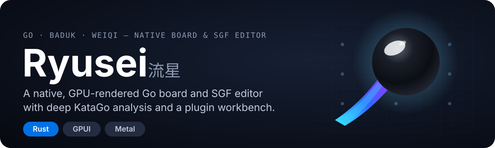
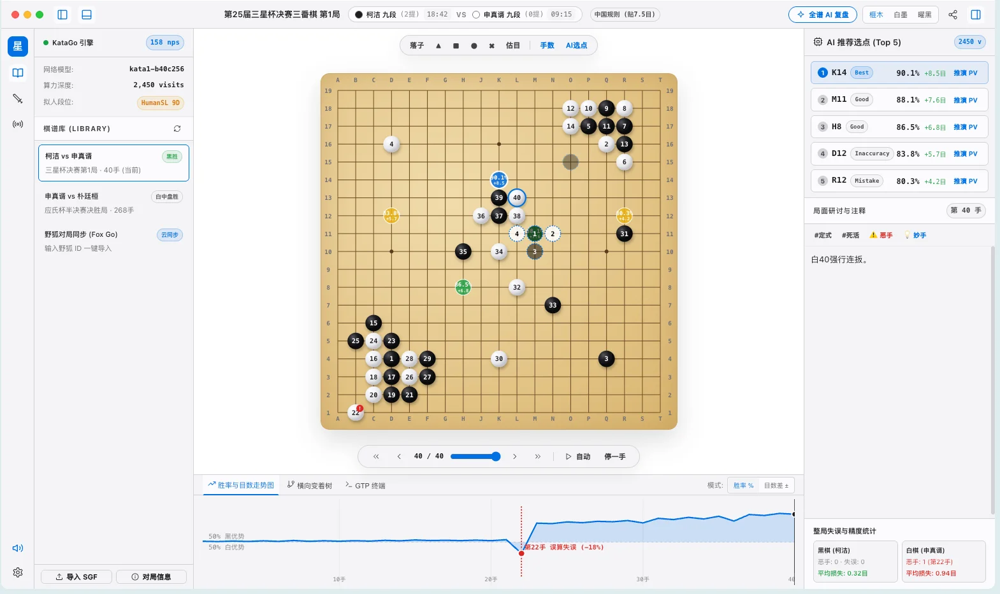
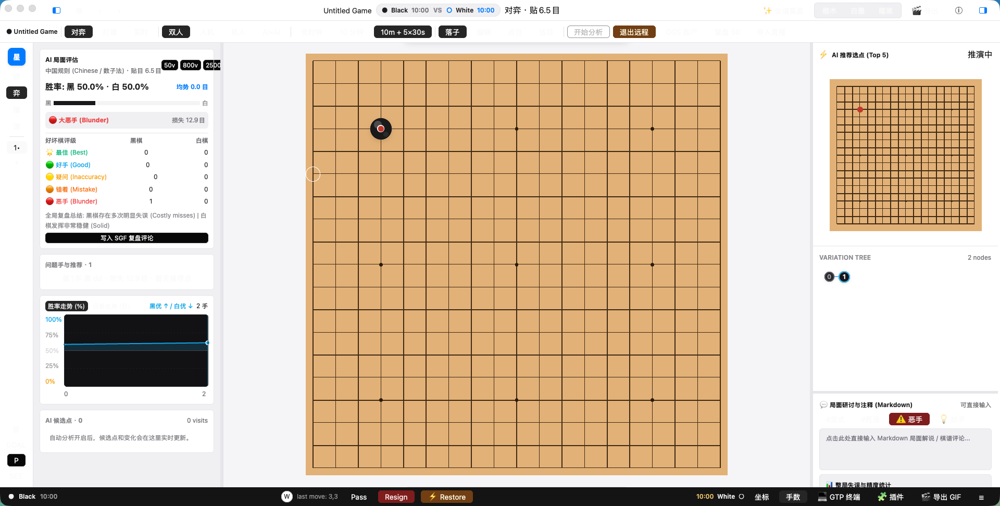

<p align="center">
  
</p>

# Ryusei (流星)

A native **Go / Baduk / Weiqi** board and SGF editor with deep KataGo analysis,
built in **Rust + GPUI**. It is a ground-up rewrite of
[Sabaki](https://github.com/SabakiHQ/Sabaki) that keeps the editor philosophy
while replacing the Electron/Node.js stack with a GPU-rendered, fully native
client.

## What it looks like

<p align="center">
  
</p>

<p align="center">
  
</p>

## Why native

The original Sabaki runs on Electron. Ryusei trades that for a native binary:

- **Metal rendering on macOS** (via blade) — no WebView, Node.js, or JavaScript.
- **One small binary** that starts fast and stays responsive through 300+ move
  games and large variation trees.
- **Typed, testable layers** — the UI-independent logic lives behind ports, so
  every workflow is testable without a window.

## Features

### Board & SGF

- Full SGF editor with strict `CA`-driven multi-encoding
  (UTF-8 / Shift_JIS / EUC-JP / GBK / Big5), atomic writes, crash recovery,
  recent files, and external-change detection.
- Markdown comments rendered and edited inline per node.
- Board markup tools (circle, triangle, square, cross, letters, dead-stone
  marking) and territory estimation.

### AI analysis

- **KataGo integration** — engine discovery, one-click setup and model download,
  live analysis, GTP terminal, and AI move generation.
- **KaTrain-style analysis UX** — horizontal variation tree with move-quality
  colors, clickable candidate list with PV preview, and a winrate / score-lead
  graph with coordinate ticks.
- **Whole-game review** — move grading (Best / Good / Inaccuracy / Mistake /
  Blunder) and per-player loss statistics.

### Online & extensibility

- **OGS (online-go.com) sync** — login, realtime play with server rules and
  clocks, automatch, and dead-stone removal.
- **Fox Go (野狐) sync** — query a player and pull recent games.
- **Plugin system** — sandboxed runtime (WASM + native processes), permission
  model, install from ZIP, pinned toolbar shortcuts.

## Getting started

```bash
cargo run -p ryusei-gpui            # launch the native client
cargo run -p ryusei-gpui -- path.sgf  # open a specific game
RYUSEI_CONFIG_DIR=/tmp/sg cargo run -p ryusei-gpui  # isolated config directory
```

On macOS the client builds with only the Command Line Tools; on Linux/Windows
the default backends apply.

## Building & testing

```bash
cargo test --workspace               # full workspace test and doctest gate
cargo build --release -p ryusei-gpui  # optimized binary
```

## Workspace layout

```
crates/domain-core       UI-independent domain core: GameDocument / SGF / board / GTP / DTOs
crates/plugin-runtime    Plugin manifests, permission model, JSON-RPC framing, native processes
crates/ryusei-host       UI-independent workflows (open/save/recovery/settings/engines/plugins)
apps/ryusei-gpui         The native GPUI client
examples/                Fake GTP engine for subprocess smoke tests; example plugins
```

UI-independent logic lives in `crates/ryusei-host`, driven through typed ports
so every layer stays testable without a window.

## Packaging

- macOS: `./scripts/bundle-macos.sh` → `dist/macos/Ryusei.app`
- Linux: `./scripts/bundle-linux-appimage.sh`
- Windows: `scripts/installer.nsi` (NSIS)
- Flatpak: `flatpak/dev.ryusei.app.yml`

## License

MIT. This project is a Rust + GPUI port of
[Sabaki](https://github.com/SabakiHQ/Sabaki) and keeps its license and
copyright notice — see `LICENSE.md`.
