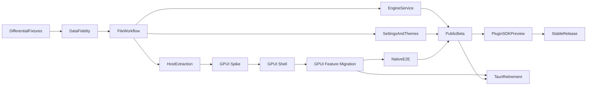

# Tauri 重构后续实施计划

本文是 Sabaki 从 Electron/Node.js 迁移到 **Rust 原生应用核心 + GPUI 客户端**
的交付路线图。架构边界见
[`tauri-rearchitecture-design.md`](tauri-rearchitecture-design.md)，兼容性要求见
[`tauri-migration-contract.md`](tauri-migration-contract.md)，当前已实现范围见
[`tauri-migration-status.md`](tauri-migration-status.md)。

Electron 版本在 GPUI 达到公开 Beta 质量前仍是行为参考、稳定发行版和回退路径。

**架构决策（2026-08）：** 全力优先发展 GPUI；**永久暂停 Tauri 回退**。`apps/ryusei-gpui`
已从 spike 升级为正式 GPUI 主客户端，Tauri/Preact 层冻结为行为参考（不再新增开发），仅保留用于对照参考行为。GPUI 是唯一迁移主线。

状态标记：✅ 已完成，◐ 部分完成，⬜ 未开始。

## 当前基线

当前迁移切片已具备以下可验证基础：

- Rust workspace、`ryusei-domain-core`（版本化
  `GameDocument`、完整 SGF 变化树、未知属性保留、棋盘快照、setup
  stones、标记、简单劫争、undo/redo 与 revision），以及 UI 无关的
  `crates/ryusei-host`（typed ports： `GameFileAccess` /
  `HostEventSink`，`HostApplication`
  拥有open/save/save-at/事务/undo/redo/恢复/丢弃来源位置；无 Tauri/GPUI 依赖）；
- 版本化 camelCase DTO 和命名事务。除 `applyScoringOverride`
  外，当前 schema 中的游戏树事务均已实现；
- Tauri adapter 已接入 host：`NativeSgfFileAccess` 实现
  `ryusei_host::GameFileAccess`，`TauriHostEventSink` 把
  `HostEvent::GameChanged` 映射为 `game-state-changed`，`ApplicationState`
  已切换为
  `Mutex<HostApplication>`，新建/打开/保存/落子/事务/撤销重做/恢复/外部clean 重载均经 host 方法路由；
- 独立的 Preact Tauri UI（Goban、导航、变化树、节点检查器、标记工具），通过
  `bridge.js`/`store.js` 工作，仅作为行为参考与过渡回退；
- 初步的插件 manifest、权限模型、原生 JSON-RPC 传输与 WASM/Go 示例；
- JavaScript 特征测试、Rust 领域测试、共享差分 fixture、Tauri 前端单元测试和前端生产构建；
- Ubuntu CI 已接入 Rust 格式检查与
  `cargo test --workspace`，但尚未形成跨平台 Tauri/GPUI 构建与原生 e2e 矩阵。

当前尚不能替代 Electron：Tauri 已具备受限的 SGF 打开、保存与另存为流程，也已完成首个安全设置迁移切片与 host-owned 最近文件/自动保存/外部修改检测；但旧格式导入与编码处理、跨版本设置默认值策略、完整主题管理（theme-token）、GTP 服务、完整 UI、WASM
runtime、原生 e2e、性能基准、GPUI Goban/theme/plugin
spike 和跨平台 CI 尚未完成。

## 总体依赖关系

## 阶段 1：行为基线与性能证据 ◐

**已完成：** DTO
schema、JavaScript 特征测试、两个共享差分 fixture，以及 Rust/JS 双方的 fixture 驱动测试。

**剩余工作：**

1. 将已有 JavaScript 特征测试中以下场景转化为共享 JSON
   fixture，并由 Rust 与 JS 两侧运行：
   - `AB`、`AW`、`AE`、压缩点、提子、自杀和劫争；
   - `CR`、`MA`、`SQ`、`TR`、`LB`、`L`、`AR`、`LN`；
   - 子变化/同级变化覆盖、首选子变化、游戏图布局；
   - 属性编辑、变化提升/删除和 undo/redo 边界。
2. 建立可重复的性能场景：19 路空棋盘、9 路死活题、大型职业棋谱、多分支教学棋谱和长时间分析流。记录打开、导航、编辑、内存和事件吞吐。
3. 为每个新增领域行为要求共享 fixture 或具有明确原因的差异说明；不得仅依赖 Tauri
   UI 测试来证明领域语义正确。

**完成条件：**
关键游戏树和棋盘语义由共享 fixture 覆盖；性能基线可在本地与 CI 中重复运行。

## 阶段 2：领域保真与文件格式 ◐

**已完成：**
版本化游戏树、多值节点属性、完整 SGF 树、未知属性保留、棋盘快照、标记/变化事务和基本 SGF
round-trip。

**剩余工作：**

1. 加入 SGF property
   tests，覆盖转义、组合值、压缩点、损坏输入和深/宽变化树；明确错误语义，保证失败不会修改已打开文档。
2. 增加大棋谱性能 smoke
   test，量化当前全树历史副本和全树快照的成本；在数据支持前不过早替换为更复杂的持久化数据结构。
3. **扩展并验证编码策略（部分完成）。** 已根据 SGF `CA`
   属性严格支持 UTF-8、Shift_JIS、EUC-JP、GBK 与 Big5，并且无法无损表示时不会保存。仍需加入历史棋谱 corpus、更多受控编码、无
   `CA`
   非 UTF-8 的失败回归，以及跨平台 round-trip 证据；保存时不得无意改变无法安全表示的内容。
4. 分别实现 NGF、GIB、UGF 导入器，复用现有 legacy fixture，并将结果转换为统一
   `GameDocument`。
5. 实现计分领域模型与 `applyScoringOverride`；补齐规则边缘场景和 `BoardSnapshot`
   与参考实现的字段级差分。
6. 为每个事务增加稳定、可本地化的结果/错误数据；互斥节点注释应改为宿主原子事务或原子批处理，避免局部成功。

**完成条件：**
SGF、NGF、GIB、UGF 的兼容性均有 Rust 测试；数据错误不会导致静默丢失，编辑都通过原子领域事务发生。

## 阶段 3：Tauri 应用服务与数据安全 ◐

**已完成：** 最小 game/settings/theme/plugin
commands、游戏状态事件、可独立测试的 SGF 文件服务、原子单文件保存、受限打开/保存对话框、保存状态 UI、安全设置迁移、宿主拥有的最近文件 registry（独立持久化、路径去重、最多 10 条、启动加载、host 侧缺失检测和仅凭不透明 ID 的重新打开），以及单文档 crash-recovery 自动保存（独立
`recovery.json`、原子写入、启动时恢复/丢弃决策、恢复后无路径 dirty 文档与显式保存后的清理），以及外部 SGF 修改检测（SHA-256 内容基线、窗口聚焦检查、clean 自动重载、dirty 冲突、来源缺失/不可读的常规 Save 阻断、保留本地修改后 Save
As）。恢复 Store 的 Restore/Discard gate 生命周期、clean
reload 后重新建立 baseline、以及 dirty conflict 后解除 source
identity 均已有确定性宿主测试；真正的原生对话框流程仍由 Tauri e2e 覆盖。

**剩余工作：**

1. 将 `src-tauri/src/main.rs` 拆分为 `game_service`、`file_service`、
   `settings_service`、`theme_service`、`engine_service`、`plugin_service` 和
   `window_service`；`main.rs` 仅保留装配。
2. 为自动保存恢复、最近文件、外部修改冲突、原生文件对话框和窗口关闭确认补齐原生 Tauri
   e2e。自动保存必须继续保持 host-owned、与原 SGF 分离；恢复后禁止常规 Save 写回来源路径。
3. 补齐设置迁移的剩余证据：用共享 fixture 锁定完整 Electron 默认键表与迁移结果，明确跨版本默认值策略，并加入原生选择器/报告的 Tauri
   e2e。
4. 完成主题安装/卸载/schema 校验、资源路径检查和 CSS 作用域限制；旧 `.asar`
   主题仅显示不兼容说明。
5. 将其余 theme/plugin command 迁移为 `CommandErrorDto`，并补齐相应 state
   events。当前 game/file/settings
   command 已返回稳定 code、message 和可选 details；theme/plugin 服务仍暂时返回裸字符串错误。

**完成条件：**
用户可通过受限 command 完成文件工作流；迁移失败不会破坏旧用户数据；服务拥有可独立测试的边界。当前已覆盖 Open、Save、Save
As、取消无副作用、host-owned 最近文件（不透明 ID 重新打开、缺失状态）、单文档 crash-recovery（恢复/丢弃、恢复后 Save
As、显式保存清理）与外部修改处理（内容基线、clean 自动重载、dirty 冲突/保留本地修改后 Save
As、常规 Save 阻断）；原生 Tauri e2e 仍待实现。

## 阶段 4：UI 迁移（过渡 Preact → 最终 GPUI）◐

**已完成（过渡 Preact）：**
store 的 revision 保护/命令串行化，及 Goban、导航、变化树、节点检查器、标记工具的第一批迁移。这段 Preact 层仅作为行为参考与过渡回退。

**剩余工作：**

1. 过渡 Preact 层不再扩展为完整产品 UI；只保留行为参考所需的打开/保存/导航/编辑能力。
2. **host 抽取（已完成）：** `ryusei-host`
   已拥有游戏文档与新/开/存/事务/撤销/重做/恢复/丢弃来源位置，且autosave/recovery、recent-files、外部文件跟踪状态机与关闭决策、
   `HostPersistence` / `ExternalFileReader` ports 均已迁入 host；`HostEvent`
   已扩展为
   `GameChanged`、`AutosaveChanged`、`ExternalFileStatusChanged`；服务级 workflow 组合断言已加入
   `crates/ryusei-host/tests/workflow.rs`。
3. **GPUI spike（已完成）：** `apps/ryusei-gpui`
   已验证 Goban 渲染/hit-testing/overlay、theme-token 应用、声明式插件 contribution 与快照吞吐基准；结论与遗留风险见后续迭代顺序。
4. **GPUI shell（已完成）：** app
   shell、窗口、菜单、快捷键、启动文件与文件对话框 adapter 均已在
   `apps/ryusei-gpui` 落地，见后续迭代顺序。
5. **GPUI 功能迁移：**
   按依赖顺序把 Goban、导航、变化树、节点检查器、标记、文件工作流、设置、引擎控制台、分析图和插件面板迁移到 GPUI；每完成一个组件簇即删除对应 Preact/Tauri 代码路径，避免维护平行的业务逻辑。
   - **导航组件簇（已完成）：** 新增 `navigation.rs`（纯函数导航目标计算：
     `navigation_target` / `navigation_availability` / `position_label`，root 节点 ID
     约定为 `"root"`、普通节点为 `node-N`，`next` 优先 `preferred_child_by_node`
     否则取第一个 child）；shell 增加 `Navigate` 导航栏（⏮/◀/▶/⏭ 按钮 + 位置标签）、
     `Navigate` 菜单、快捷键（`cmd-left`/`left`/`right`/`cmd-right`）与
     `GoToFirstNode` 等 4 个 actions，均经
     `HostApplication::apply_transaction(Navigate)` 路由。4 个导航单元测试覆盖
     线性/根节点/分支（preferred child）/位置标签。
   - **变化树组件簇（已完成）：** 新增 `variation_tree.rs`
     （布局为纯函数 `build_variation_tree_layout`：preferred child 链水平延伸、
     同级分支垂直悬挂，每个节点记录父节点坐标以便渲染连线；`render_variation_tree`
     用 GPUI 元素渲染节点圆点 + 连线，点击节点经 weak entity 路由到
     `navigate_to_node`）；shell 在右侧面板旁渲染变化树并标注当前节点。
     4 个布局单元测试覆盖线性/分支（sibling 垂直）/当前节点标记/最深层 y。
   - **标记工具组件簇（已完成）：** 新增 `markup.rs`（`MarkupTool` 枚举
     Play/Circle/Square/Triangle/Cross/Label，`create_markup_transaction`
     生成 `AddMarkup` 事务映射到 `CR`/`SQ`/`TR`/`MA`/`LB`，`markup_symbol`
     渲染单字符标记符号）；shell 增加工具栏（`render_markup_toolbar`，活动工具
     高亮），棋盘点击按当前工具分发：Play 落子、其余挂标记到当前节点；
     `goban_view` 渲染标记叠加层（标记符号显示于交点）。5 个单元测试覆盖
     Play 无事务/圆标记/标签文本/各工具 SGF property 映射/符号字形。
   - **节点检查器组件簇（已完成）：** 新增 `node_inspector.rs`
     （`current_node_metadata` 纯函数提取当前节点标题/注释/属性行/可编辑变化，
     `create_comment_transaction` 经 `SetNodeProperty`/`RemoveNodeProperty`
     编辑 `C` 属性，`create_variation_transaction` 生成
     `PromoteVariation`/`RemoveVariation`）；shell 渲染节点检查器面板
     （标题、可聚焦注释输入框——键盘输入/退格/回车保存/Esc 还原、属性表、
     分支节点的 promote/remove 按钮）。6 个单元测试覆盖
     元数据提取/标题回退/空注释删除/注释设置/变化操作映射/节点缺失占位。
   - **文件工作流组件簇（已完成）：** 新增 `file_workflow.rs`
     （`MemoryHostPersistence` 实现 `ryusei_host::HostPersistence`，
     `record_opened_file` / `capture_autosave` / `clear_autosave`
     封装 host 的 recent-files 与 crash-recovery 工作流，持久化失败时
     host 辅助回滚内存 store）；shell 接入：打开/另存为后记录 recent-files、
     dirty 编辑后捕获 recovery、显式保存后清除 recovery、状态栏显示
     recent/recovery 状态，recovery 可用时显示 restore/discard 按钮
     （`restore_from_sgf` 恢复为无路径 dirty 文档）。2 个单元测试覆盖
     recent 记录与 recovery 捕获/清除。
   - **设置组件簇（已完成）：** 新增 `settings.rs`（`ThemeChoice`
     Classic/Dark/Mist 命名主题，每个映射到已校验的 `ThemeTokens`；
     `is_supported_setting` 校验已知设置键，`BOARD_SIZE_OPTIONS`
     提供 9/13/19 路）；shell 增加设置面板（主题切换实时应用 token、
     棋盘尺寸切换经 `create_new` 重置棋局），替换原先硬编码的经典主题。
     4 个单元测试覆盖主题 token 有效/互异、设置键识别、棋盘尺寸选项。
   - **引擎控制台组件簇（已完成）：** 新增 `engine_console.rs`
     （`GtpEngine` 端口抽象 + `MockGtpEngine` 内存引擎：协议握手/boardsize/
     clear_board/play/genmove/known_command/list_commands；`parse_gtp_vertex`
     与 `format_gtp_vertex` 坐标转换、`parse_console_response` 复用
     domain-core 的 `parse_response`、`EngineLogEntry` 日志条目）；shell
     渲染引擎控制台面板（日志滚动 + 可聚焦命令输入框，回车发送、Esc 清空），
     `boardsize` 命令成功时同步棋盘尺寸。5 个单元测试覆盖
     握手/占位追踪/着法生成/坐标往返/日志条目。
   - **插件面板组件簇（已完成）：** 新增 `plugin_panel.rs`
     （`entry_from_manifest` / `entry_from_record` 从
     `ryusei-plugin-runtime` 的 `PluginManifest`/`PluginRecord` 提取插件
     名称/版本/启用态/权限/命令/菜单贡献，`parse_manifest` 复用 host
     的 `manifest.validate()`）；spike 依赖 `ryusei-plugin-runtime`，
     shell 右侧渲染已安装插件列表 + 声明式 closed-set 面板贡献。
     3 个单元测试覆盖 manifest 摘要/记录（启用态+授权权限）/非法 manifest
     拒绝。至此 **GPUI 功能迁移 8 个组件簇全部完成**。

**完成条件：** GPUI 可完成打开、浏览、编辑、保存和首选项管理；视图只通过
`ryusei-host` typed API 与 DTO 通信；过渡 Preact/Tauri UI 只作为回退存在。

## 阶段 5：完整 GTP 引擎服务 ⬜

在现有 GTP 解析基础上实现进程监督、队列、取消、超时、能力探测、棋局同步、
`analyze`/`kata-analyze`/`lz-analyze`
流、结构化日志、崩溃恢复和命名 events（过渡期映射为 Tauri
events，最终由 GPUI 直接订阅）。复用现有 engine transcript
fixture 作为协议回归数据，并为 Windows、macOS、Linux 和 Flatpak 明确进程/路径策略。

**完成条件：**
常用 GTP 引擎可稳定对弈、分析、停止和恢复；引擎崩溃不影响宿主进程。

## 阶段 6：插件 SDK Preview ◐

**已完成：** manifest、权限、原生执行授权、JSON-RPC 消息帧与两种示例。

**剩余工作：** 声明式命令/菜单/设置/侧栏/面板贡献（host 校验、closed-set
widgets）、WASM runtime 与 capability
imports、内存/燃料/输出限制、插件私有存储、原生进程超时/取消/重启/日志、SDK 文档和端到端示例验证。

**完成条件：**
WASM 默认没有文件、网络、进程和剪贴板能力；原生插件未经独立授权不能运行，崩溃不会影响宿主；插件面板不加载任意 Web
UI。

## 阶段 7：Beta、发布与 Tauri 退役决策 ⬜

新增 Rust/GUI
CI 矩阵（含 headless/GPU）、原生 screenshot/交互 e2e、签名/公证/自动更新、升级/降级/文件关联测试和性能对比。公开 Beta 期间保留 Electron 下载与可导出的本地诊断，且不默认上传棋谱。仅在数据兼容、设置迁移、核心 UI、GTP、插件边界和支持平台验证都达标后，才讨论 Tauri 退役与 Electron 退役决策。

## 近期迭代

### 迭代 C′：数据保真与文件工作流

**目标：**
让已完成的可编辑 Tauri 棋盘能够安全地打开、编辑并保存用户 SGF，同时为后续 UI 扩展建立领域保真和文件服务基础。

**范围与顺序：**

1. **扩充共享差分 fixture。** 先把已有 JS 行为测试中的 setup
   stones、压缩点、提子/ 自杀/劫争、标记、变化操作和历史边界固化为 Rust/JS 共用 JSON
   fixture；补齐失败情况的稳定期望值。
2. **硬化 SGF 读写。** 添加 parser/serializer property tests、损坏文件测试、`CA`
   编码处理策略和大型棋谱性能 smoke
   test。任何读写失败都必须保持内存文档和原文件不变。
3. **提取文件服务。** 将打开、保存、原子写入、路径/dirty 状态和文件错误移出
   `main.rs`；实现受限文件对话框 command，不向前端泄露通用文件 API。**已完成：**
   `file_service` 已处理基于 `CA`
   的严格编码读取/无损写回拒绝、同目录唯一临时文件的原子替换、默认扩展名和对话框取消；`game_workflow_service`
   已提供可注入文件访问；`recent_files_service`
   已处理不透明 ID 的最近文件，`autosave_service`
   已处理与原 SGF 分离的单文档 crash-recovery，`external_file_service`
   已处理 SHA-256 内容基线和安全的外部变更状态。尚待文件编码与跨平台 watcher/e2e。
4. **连接前端工作流。** 在 bridge/store 中增加 open/save
   action、文件状态和稳定错误显示；在 Tauri
   UI 加入打开、保存、另存为和 dirty 状态，且命令仍经 revision-aware
   store 串行化。**已完成：** Open、Save、Save
   As、取消无副作用、未保存替换确认、宿主拥有的关闭确认，以及 game/file
   command 的 `CommandErrorDto`
   归一化与 game/file 命令忙碌状态；其余服务的错误 DTO 仍待实现。
5. **验证真实流程。** 覆盖“打开 fixture → 编辑落子/注释/变化 → 原子保存 →
   Rust 再打开 → JavaScript 参考 `parseFile()` 读取”的集成回归；共享
   `file-workflow.sgf`
   artifact 由 Rust 序列化断言锁定。原生文件对话框的最小 Tauri
   e2e 仍待新增，并保持 Electron e2e 作为行为参考。

**不在本迭代范围内：** GTP 监督、计分 UI、NGF/GIB/UGF 导入、WASM
runtime、完整设置/主题管理。这些能力依赖文件/领域边界稳定后再推进。

**验收条件：**

- Tauri UI 可通过宿主对话框打开和保存 SGF；
- 保存使用原子写入，失败不破坏原文件；
- 新增 SGF/棋盘行为在 Rust 与 JavaScript 共享 fixture 中一致；
- 有至少一个 Tauri 端到端的打开、编辑、保存回归路径；
- `npm test`、`npm run format-check`、`npm run tauri:frontend:build`、
  `cargo test --workspace` 和 `cargo fmt --all -- --check` 全部通过。

### 迭代 C″：编码保真与可测试宿主工作流

**已完成：** `file_service` 已从字节读取 SGF，基于 `CA`
明确支持 UTF-8、Shift_JIS、EUC-JP、GBK 与 Big5；不支持、无效或需要 replacement 的解码/编码会失败，不修改来源文件。正常 Save 会保留打开时的来源编码，无法无损表示的编辑会被阻止。`game_workflow_service`
已将文件读取/写入抽象为可注入的窄接口，原生 adapter 与内存 adapter 均有测试。`host_persistence_service`
进一步将 recovery/recent-files 的加载、持久化和清理抽象为
`HostPersistence`，生产环境只提供路径 adapter，测试可注入内存 adapter 和持久化失败。

**下一步范围：**

1. 将 host event sender 抽象为可注入依赖，并将现有 `HostPersistence`
   与文件访问 boundary 组合成不触碰真实 app config dir 的 command/service-level
   workflow tests。
2. 针对每种已支持编码增加真实历史棋谱 corpus 与完整的“打开 → 编辑 → 原编码保存 → 再打开”回归；明确并测试无
   `CA` 的非 UTF-8 输入继续安全失败。
3. 扩展 `game_workflow_service` 承担 open/save/reload 的协调，继续从 `main.rs`
   移出工作流实现；Tauri command 只负责 DTO、状态锁和 event adapter。
4. 在该 seam 上建立最小 Tauri e2e
   harness，并覆盖打开/编辑/保存、恢复、外部冲突与关闭确认，不把 mocked service
   coverage 误称为 native e2e。

**完成条件：**

- 任一解码或无损编码失败都不会替换内存文档、来源文件、external-file
  baseline 或 recovery；
- workflow service 可用临时目录和替身依赖覆盖恢复、Save
  As 与外部冲突的状态转换；
- 至少一条真实 Tauri 窗口回归路径进入 CI。

### 后续迭代顺序

1. **迭代 H：宿主状态迁移与 typed events 扩展 ✅。**
   autosave/recovery、最近文件、外部文件跟踪状态机与关闭决策迁入 `ryusei-host`
   的 `autosave` / `recent_files` / `external_file` / `persistence` /
   `close_flow` 模块；`HostEvent` 扩展为
   `GameChanged`、`AutosaveChanged`、`ExternalFileStatusChanged`；Tauri
   adapter 只保留原生文件读写与 host events 映射；新增
   `crates/ryusei-host/tests/workflow.rs` 服务级组合断言（崩溃恢复 → Save
   As、clean 外部重载、dirty 冲突 → keep local → Save
   As、关闭决策 gate、recent-files 经 port 记录）。
2. **迭代 Gpui-Spike：GPUI 风险退坡验证 ✅。** 已创建
   `apps/ryusei-gpui`（workspace member，依赖 `gpui 0.2.2` +
   `ryusei-host` + `ryusei-domain-core`）。验证结论：
   - **构建可行性：** gpui 0.2.2 在 crates.io 可用；在 macOS arm64 仅有 Command
     Line Tools（无完整 Xcode / `xcrun metal`）的环境下，通过 `macos-blade`
     feature 使用 blade/WGSL 后端可编译、可启动窗口；仅需完整 Xcode 的 CI 上可启用默认 Metal 后端。
   - **Goban 渲染/hit-testing：** `goban_view.rs`
     用纯 GPUI 元素渲染棋盘网格、星位、棋子，并提供像素坐标 → 棋盘顶点转换与往返测试（19/9 路）。
   - **theme-token 应用：** `theme.rs` 定义版本化 `ThemeTokens`（schema
     v1，`#RRGGBB` 校验），spike 从 JSON 解析并应用到棋盘/背景渲染。
   - **声明式插件 contribution：** `plugin_contribution.rs`
     定义 host 校验的 closed-set
     `PanelWidget`（Label/Value/Button/Select），spike 解析并渲染示例面板。
   - **性能基准：** `benchmark.rs`
     记录快照吞吐基线（本机 19×19、50 手、1000 次快照 ≈
     651µs/快照），供后续与 Electron/Tauri 参考对比。
   - 遗留风险：`gpui 0.2.2`
     仍无正式语义版本；跨平台（Windows/Linux）渲染与 headless/GPU
     CI 未验证；无障碍、原生 screenshot 测试仍待搭建。
3. **迭代 Gpui-Shell：GPUI app shell ✅。** 已升级
   `apps/ryusei-gpui` 为正式 GPUI 应用外壳：
   - **窗口与外壳：** `ShellApp` 取代 spike 演示 app，接入
     `ryusei_host::HostApplication` 完整工作流（新建/打开/保存/另存为/落子/撤销/重做），
     并显示状态栏（status、dirty 状态、来源路径、benchmark）。
   - **菜单栏：** 通过 `gpui::actions!` + `cx.set_menus` 定义
     `Sabaki` / `File` / `Edit` 三组菜单，动作直接路由到 shell view 的 host
     方法。
   - **快捷键：** `cx.bind_keys` 绑定
     `cmd-n`（新建）、`cmd-o`（打开）、`cmd-s`（保存）、`cmd-shift-s`（另存为）、
     `cmd-z` / `cmd-shift-z`（撤销/重做）、`cmd-q`（退出）。
   - **启动文件：** 支持命令行参数传入 SGF 路径，作为启动时打开的文件
     （`MockDialogService.open_path` seed），打开失败不会替换默认棋局并显示错误状态。
   - **文件对话框 adapter：** 确认 `gpui 0.2.2`
     无原生文件对话框，新增 `DialogService` typed port
     （`pick_open_path` / `pick_save_path`）与确定性
     `MockDialogService`；`NativeGameFileAccess` 通过 std::fs 实现
     `ryusei_host::GameFileAccess`（UTF-8，完整 `CA` 编码策略复用 Tauri
     adapter）。未来平台原生对话框以同一 port 实现，host 工作流不变。
   - **验证：** 17 个单元测试通过（含对话框 port 行为、原生文件访问
     round-trip、拒绝非 UTF-8 写回）；本机启动带启动文件的 shell 无 panic，
     workspace 全量构建通过。遗留：菜单/快捷键的交互验证仍需后续
     headless/GPU e2e 覆盖。
4. **迭代 Gpui-Features：**
   按依赖顺序把 Goban、导航、变化树、节点检查器、标记、文件工作流、设置、引擎控制台、分析图与插件面板迁移到 GPUI。
5. **迭代 D：** 设置、theme-token、主题和窗口/文件状态迁移（最终落在 GPUI）。
6. **迭代 E：** GTP 引擎监督、分析流与引擎 UI。
7. **迭代 F：** WASM runtime、原生 JSON-RPC 完整生命周期与 SDK Preview。
8. **迭代 G：**
   原生 e2e、跨平台 CI、签名、Beta 和兼容性验证；达标后执行 Tauri 退役。
