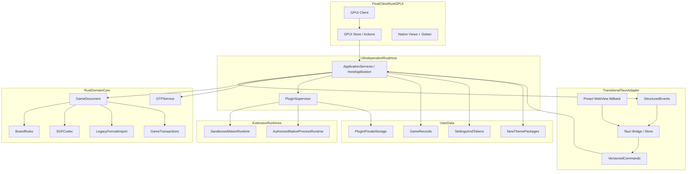
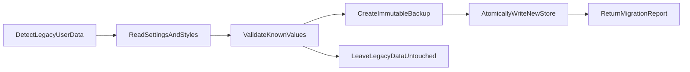
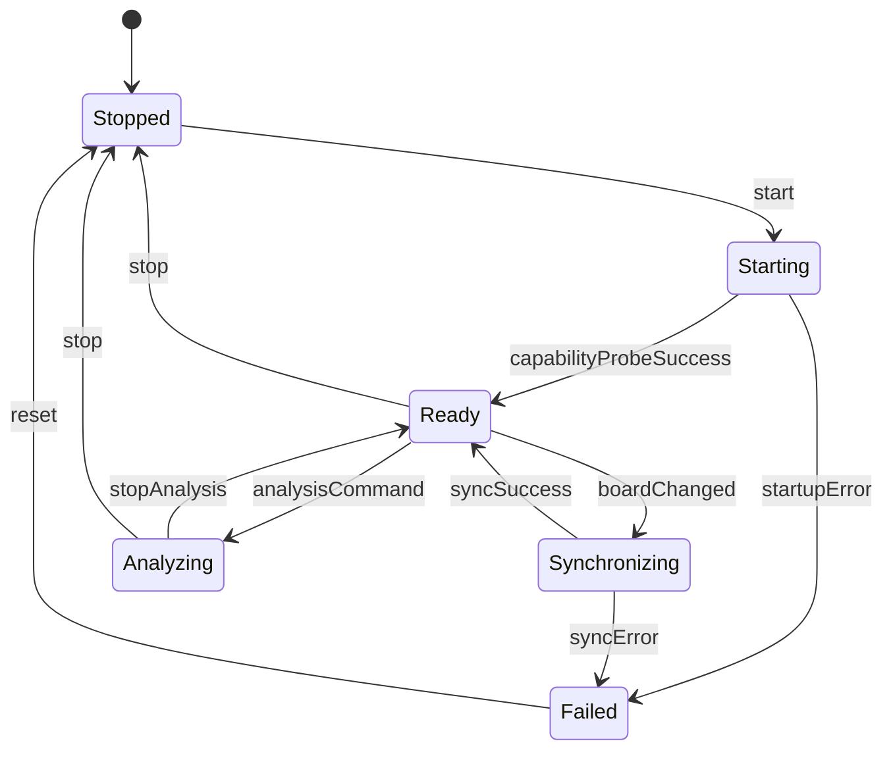
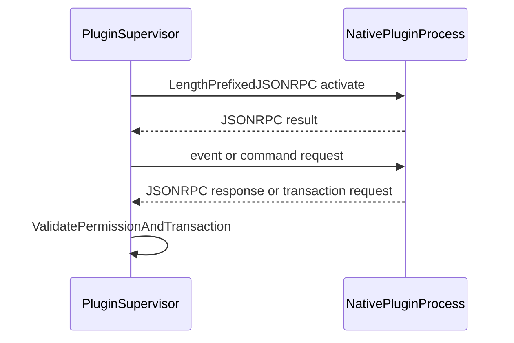

# Sabaki 原生 GPUI 重构总体设计

本文定义 Sabaki 从 Electron/Node.js 架构迁移到 **Rust 原生应用核心 +
GPUI 客户端**
的目标设计。Tauri/Preact 在迁移期间仅保留为过渡 adapter、UI 行为参考和回退切片；它不再是最终客户端架构。

- 迁移契约见 [`tauri-migration-contract.md`](tauri-migration-contract.md)。
- 分阶段交付顺序见
  [`tauri-migration-next-steps.md`](tauri-migration-next-steps.md)。

Electron 版本在原生 GPUI 版本达到公开 Beta 质量以前仍是行为参考、稳定发行版和回退路径。

## 1. 目标与非目标

### 目标

1. 使用 Rust + GPUI 替换 Electron 主进程、preload
   bridge、Node 运行时依赖以及 WebView/Preact 渲染层；最终客户端是纯 Rust 原生应用。
2. 先抽出 UI 无关的 `sabaki-host` 应用核心，再在其上构建 GPUI
   adapter；Tauri/Preact 仅作为过渡 adapter、UI 行为参考和回退切片，直到 GPUI 达到 Beta 质量。
3. 将棋谱、棋局规则、文件格式、引擎、设置和插件生命周期移入可测试的 Rust 服务。
4. 默认最小权限：UI 层不获得文件系统、进程、网络或任意原生 API；能力边界由
   `sabaki-host` typed ports 定义，而不是 WebView 安全限制。
5. 兼容 SGF、NGF、GIB、UGF 文件，以及现有 `settings.json`
   与引擎设置；`styles.css` 采用版本化 theme-token + asset
   manifest 的迁移策略，不承诺运行时/二进制兼容。
6. 采用分层插件模型：默认受限 WASM/声明式扩展；受用户明确授权的 Go/Rust 原生进程插件。插件 UI 使用 host 校验的声明式贡献模型，不再采用 arbitrary
   Web UI / Web Panel。
7. 保持跨平台：macOS（Apple
   Silicon 与 Intel）、Windows、Linux；Flatpak 需单独验证。

### 非目标

1. 不兼容旧 `.asar` 主题包；新主题有独立格式。
2. 不向插件开放 Rust 内部 crate、Tauri/GPUI
   internals、原生 DOM 或 Preact 组件实例。
3. 不用 Node `vm`、worker thread 或普通子进程冒充“安全沙箱”。
4. 第一版不提供公开插件商店、自动下载未知插件，或未经授权的本机二进制执行。
5. 不要求在迁移初期删除 Electron 项目文件或现有 e2e 测试。
6. 不把 Tauri/Preact 或 Electron 的 CSS/Web Panel 模型当作最终 UI 兼容契约。

## 2. 架构总览



要点：

- GPUI 客户端与 Preact/Tauri 过渡 adapter 是同一 `sabaki-host` 的两个 consumer；
- host 通过 typed ports（如 `GameFileAccess`、`HostEventSink`，后续扩展
  `Persistence`、`DialogService`、`ResourceAccess`、`WindowService`）与 adapter 对接；
- 过渡期 Tauri command/event 只存在于 adapter 外层，最终随 Tauri 退役移除。

## 3. 进程与信任边界

### 3.1 UI 层（最终 GPUI / 过渡 WebView）

最终 GPUI 客户端是同一进程内的 Rust 视图层。过渡期 Preact UI 在 Tauri
WebView 中运行，只能调用由 `src/tauri/bridge.js` 封装的、显式允许的Tauri
commands，并监听结构化事件。

UI 层（无论 GPUI 还是 WebView）**不得**直接访问：

- 文件路径或文件系统；
- 子进程、引擎二进制或原生插件二进制；
- 通用 shell 调用；
- 原始网络请求能力；
- 宿主设置文件或插件目录；
- Rust 游戏树对象或可变棋盘对象；
- host 内部 Rust 类型（GPUI 视图只与 typed ports / DTO 交互）。

在 GPUI 下，这一边界不是 WebView 安全限制，而是应用 API 的模块与能力边界。

### 3.2 UI 无关的 Rust host

`sabaki-host` 是唯一拥有本机能力的应用核心，负责：

- 受控文件读写、对话框、剪贴板、外链和配置目录（通过 adapter ports 完成）；
- 游戏文档、设置、主题、引擎和插件状态；
- 任务级操作（open/save/reload/recovery/external-file）、错误转换与事件推送；
- 原生引擎和原生插件的启动、停止、超时、重启和崩溃隔离。

host 不把“通用能力”透传给 UI，而是提供任务级操作。例如 `save`
可以保存当前 SGF，`save_at` 需要 host 持有 source
path 与 encoding；它们不能被替换为“向任意路径写任意字节”或“从任意路径读取任意字节”的通用接口。Tauri
adapter 只把 host 操作映射为 command，把 host 事件映射为 Tauri event。

### 3.3 独立原生进程

GTP 引擎与可信原生插件都作为独立进程运行。它们崩溃或卡死不会破坏宿主内存，宿主可终止并重启它们。

但独立进程**不等于安全沙箱**：原生插件依然可能拥有当前用户的操作系统权限。因此原生插件必须由用户明确授权，并应在安装界面显示其请求的权限、发行者和本机代码警告。

## 4. Rust 领域核心

`crates/domain-core`
是围棋与棋谱的确定性领域层。它不得依赖 Tauri、窗口、文件对话框、UI、本地化或插件进程。该约束使它可被 Rust 单测、基准和差分测试独立验证。

### 4.1 GameDocument

当前领域核心已经采用版本化游戏树；后续迭代将在保持此前端 DTO 边界的前提下，继续补齐计分、性能和兼容性能力：

```text
GameDocument
  ├─ rootProperties
  ├─ nodeStore
  │   └─ nodeId -> Node
  ├─ rootNodeId
  ├─ currentNodeId
  ├─ preferredChildByNode
  ├─ undoHistory
  ├─ redoHistory
  └─ sourceMetadata
```

每个 `Node` 至少包含：

- 稳定 node ID、父 node ID、子节点有序列表；
- 多值 SGF 属性；
- 创建它的事务元信息；
- 为棋盘、标记、变化和分析快照提供的派生索引。

内部实现可使用持久化数据结构或基于版本的写时复制；前端只接受不可变 DTO 快照。

### 4.2 事务模型

前端与插件不会直接修改树，而是提交命名事务：

```text
GameTransaction
  ├─ PlayMove
  ├─ Pass
  ├─ SetNodeProperty
  ├─ RemoveNodeProperty
  ├─ AddMarkup
  ├─ AppendVariation
  ├─ RemoveVariation
  ├─ PromoteVariation
  ├─ Navigate
  └─ ApplyScoringOverride
```

一次事务必须满足以下原则：

1. 先校验权限、文档版本和棋盘规则，再修改文档；
2. 成功后写入 undo history 并清空或重建 redo history；
3. 返回新的完整或增量快照；
4. 通过 `game-state-changed` 发布结构化事件；
5. 出错时不改变文档，返回可本地化的稳定错误码与上下文。

### 4.3 棋盘规则与派生状态

棋盘规则层负责：

- 正常落子、提子、气、禁入点与劫争；
- 虚手、让子、setup stone、矩形棋盘和非法局面兼容；
- 当前落子点、下一手玩家、手数、变化候选和同级变化候选；
- SGF 标记、标签、箭头、线条和注释相关的显示 DTO；
- 计分模式和死子覆盖。

`BoardSnapshot`
是前端读取棋盘的唯一对象。它包括尺寸、落子矩阵、标记、线条、变化覆盖、坐标变换所需信息以及当前操作上下文；它不暴露内部棋盘实现。

### 4.4 文件格式

格式层分为：

- **SGF
  codec**：完整 SGF 树、未知属性保留、组合值、压缩点、转义、格式化和安全序列化；
- **legacy importers**：NGF、GIB、UGF 解析为统一 `GameDocument`；
- **file
  service**：路径确认、文件读写、编码处理、原子保存、外部修改检测、近期文件和自动保存。

导入器只生成领域对象，不弹对话框、不修改设置。用户提示由宿主/前端层根据稳定错误码完成。

## 5. UI 无关的 host 服务与 adapter

`sabaki-host` 是最终服务层，`src-tauri` 只保留过渡 adapter。

| 服务               | 职责                                                       | 最终归属                    |
| ------------------ | ---------------------------------------------------------- | --------------------------- |
| `HostApplication`  | 文档管理、事务、undo/redo、快照、open/save/reload/recovery | `sabaki-host`               |
| `GameFileAccess`   | 文件读写、编码处理、原子保存（port）                       | `sabaki-host`               |
| `HostPersistence`  | 自动保存、最近文件（port）                                 | `sabaki-host`               |
| `HostEventSink`    | 状态变化事件（port）                                       | `sabaki-host`               |
| `file_service`     | Tauri adapter：对话框、编码、原子写入                      | 过渡期保留，迁入 host codec |
| `settings_service` | 默认值、迁移、持久化、theme-token 设置变更事件             | 过渡期保留                  |
| `theme_service`    | 新主题发现、验证、安装、卸载和资源路径控制                 | 过渡期保留                  |
| `engine_service`   | GTP 进程、同步、分析流、控制台与恢复                       | 过渡期保留                  |
| `plugin_service`   | 插件安装、权限、状态、运行时、日志和贡献注册               | 过渡期保留                  |
| `window_service`   | 窗口状态、全屏、菜单、快捷键和启动文件                     | Tauri/GPUI adapter          |

服务之间通过 Rust 类型或受控事件通信，不通过前端 round-trip 作为内部协调方式。

## 6. 协议：Tauri command/event（过渡）与 host typed API（最终）

### 6.1 过渡期 Tauri commands

Tauri command 是过渡 adapter 的稳定用户意图入口，最终被 GPUI 对 `sabaki-host`
的直接调用替代：

```text
GameCommands
  game_create_new
  game_open_dialog
  game_save
  game_save_dialog
  game_snapshot
  game_apply_transaction
  game_undo
  game_redo

SettingsCommands
  settings_snapshot
  settings_set
  settings_import_legacy

EngineCommands
  engines_list
  engine_start
  engine_stop
  engine_send_command
  engine_set_analysis

PluginCommands
  plugins_list
  plugins_install
  plugins_grant_permissions
  plugins_authorize_native_execution
  plugins_enable
  plugins_disable
```

过渡期 command 仍必须：

- 使用 DTO 参数，而非内部引用；
- 校验传入数据和授权；
- 返回 `Result<DTO, CommandErrorDto>`；
- 不依赖调用方是主窗口、插件页面或测试环境；
- 在需要时包含文档 revision，防止异步旧请求覆盖新状态。

### 6.2 host typed API（最终）

最终 GPUI 客户端直接调用 `sabaki-host`
的 typed 方法与 ports，不再经过 command/DTO transport。host 状态变化通过
`HostEventSink` 以 typed `HostEvent`（如
`GameChanged { snapshot }`）下发，由 GPUI adapter 直接消费，或由 Tauri
adapter 映射为 `game-state-changed` Tauri event。

### 6.3 Events（过渡期映射）

Tauri event 只存在于过渡 adapter 外层，payload 必须是版本化、可序列化 DTO：

```text
GameEvents
  game-state-changed
  game-file-state-changed

EngineEvents
  engine-state-changed
  engine-analysis-updated
  engine-console-output
  engine-failed

SettingsEvents
  settings-changed
  theme-list-changed

PluginEvents
  plugin-state-changed
  plugin-log-entry
  plugin-failed
```

高频分析事件需要节流和合并，避免渲染层因 GTP 流过载。

## 7. UI 迁移设计（过渡 Preact → 最终 GPUI）

### 7.1 过渡期 Preact store

`src/tauri/store.js` 是过渡 Preact 前端状态的唯一拥有者：

1. 启动时读取领域、设置、主题和引擎快照；
2. 注册 Tauri host 事件监听器；
3. 按文档/引擎维度对用户命令串行化；
4. 在 command 成功返回时立即更新本地快照，并可接受等价 host event；
5. 对 revision 过期、失败和冲突给出确定性的 UI 状态；
6. 在窗口卸载时注销所有监听器。

组件不应各自调用
`invoke()`；它们通过 store 的动作和 selector 读取数据。这段 Preact 层只作为行为参考与过渡回退，不再扩展为完整产品 UI。

### 7.2 GPUI 原生 UI（最终）

最终 UI 使用 Rust GPUI 构建，包括：

- GPUI app shell、窗口状态、菜单、快捷键和启动文件；
- 原生 Goban 渲染、hit-testing、坐标与 overlay（替代 Shudan/WebView 渲染）；
- 主题通过版本化 theme-token + asset manifest 应用，不再解析用户 `styles.css`；
- 插件面板使用 host 校验的声明式 contribution 渲染，不加载任意 Web UI；
- 可访问性、原生 screenshot 交互测试、headless/GPU CI 全部重建。

GPUI 视图只读取 `sabaki-host` 的快照/DTO 并调用 typed actions；不持有 source
path、原始文件内容或可写 `GameDocument`。

## 8. 设置、theme-token 与主题

### 8.1 旧设置迁移

旧用户数据中必须迁移：

- `settings.json` 中认可的设置；
- `engines.list` 与分析命令配置；
- `styles.css` 用户样式（仅迁移可表达为 theme-token 的部分）；
- 窗口、语言、棋盘、显示和声音偏好。

迁移流程：



未知键不能静默写入新配置，也不能直接删除；必须在迁移报告中列出。任何写入前先保留原文件备份，写入失败时不影响旧数据。

**`styles.css` 兼容性决策：** 不承诺对用户 `styles.css`
的运行时/二进制兼容。旧 CSS 中可表达为 theme-token 的值（颜色、棋盘材质、棋子材质）在迁移报告中列出并可导入新 token 格式；其余 CSS 规则不迁移。

### 8.2 新主题格式（versioned theme-token + asset manifest）

主题包使用目录或受限归档，结构如下：

```text
theme-id/
  theme.json
  tokens.json
  board.png
  black-stone.png
  white-stone.png
```

`theme.json` 声明 schema version、ID、名称、版本和允许的资源； `tokens.json`
声明版本化 theme-token（颜色、材质、尺寸等），由 host 校验并由 GPUI 渲染层应用；不再加载
`theme.css`。主题服务必须验证：路径不穿越主题目录、manifest字段有效、token
schema 符合版本、资源类型/大小符合限制。

旧 `.asar` 主题只显示迁移说明，不执行、不解包且不读取其中的 JavaScript。

## 9. GTP 引擎服务

引擎是外部可执行程序而非普通插件。`engine_service`
为每个引擎维护一个有状态的 GTP 会话：



服务需实现：

- 命令队列、请求 ID、超时、取消和退出处理；
- `name`、`version`、`protocol_version`、`list_commands` 能力发现；
- 让子、回放、增量同步和完整重排；
- `analyze`、`kata-analyze`、`lz-analyze` 的流式解析和节流事件；
- stderr/控制台日志、崩溃诊断与安全重启；
- 针对 Flatpak 和平台路径的专门策略。

引擎服务不允许把子进程句柄、原始标准输入或标准输出暴露给前端。

## 10. 插件系统设计

### 10.1 插件包和 manifest

每个插件必须提供 `sabaki-plugin.json`：

```json
{
  "schemaVersion": 1,
  "id": "org.example.opening-trainer",
  "name": "Opening Trainer",
  "version": "1.0.0",
  "apiVersion": 1,
  "runtime": "wasm",
  "entrypoint": "plugin.wasm",
  "activationEvents": ["onCommand:org.example.opening-trainer.start"],
  "permissions": ["gameRead", "storage"],
  "contributes": {
    "commands": [
      {
        "id": "org.example.opening-trainer.start",
        "title": "Start Opening Trainer"
      }
    ]
  }
}
```

安装时验证 manifest schema、API
version、反向域名 ID、命令命名空间、入口路径和权限。插件入口不能使用绝对路径或
`..` 路径穿越。

### 10.2 公开插件 API

稳定 API 以版本化协议表达，而非导出 Rust 类型：

| 能力     | API 行为                                                                              |
| -------- | ------------------------------------------------------------------------------------- |
| 命令     | 注册命令，接收经过校验的上下文                                                        |
| 菜单     | 声明受控菜单/工具栏位置                                                               |
| 设置     | 声明 schema，由宿主渲染和保存                                                         |
| 棋局读取 | 获取不可变 `GameSnapshot` 或位置快照                                                  |
| 棋局写入 | 提交命名 `GameTransaction`，自动进入 undo/redo                                        |
| 事件     | 订阅棋局、引擎、主题或应用生命周期事件                                                |
| 存储     | 使用插件 ID 命名空间下的持久化数据                                                    |
| UI       | 贡献 host 校验的声明式面板数据（closed-set widgets）；不再支持任意 Web UI / Web Panel |

API 不提供
`setState()`、内部游戏树、任意文件路径、任意 shell、Electron 等价对象或宿主 DOM 引用；在 GPUI 下也不暴露任意 GPUI
Rust 组件/GPU context。

### 10.3 WASM / 声明式层

WASM 和声明式插件是默认推荐层：

- WASM runtime 默认无 host import；
- host 根据已授权权限提供最小 capability import；
- 每次调用有内存、燃料、CPU 时间和 payload 大小限制；
- 输入是不可变 DTO，输出是校验后的结构化结果或事务请求；
- 事务仍由宿主验证并写入历史；
- 不允许 WASI 文件系统、网络、进程、时钟或随机数能力，除非未来设计了明确 capability。

### 10.4 可信原生层

原生插件可以用 Go 或 Rust 编写，作为单独的本机二进制运行：



规则：

- 进程使用长度前缀 JSON-RPC over stdio；
- 单次消息、运行时间、重启次数和日志量均有限制；
- 原生执行需要额外的用户明确授权，普通启用不等同于执行授权；
- 每次崩溃记录诊断并自动禁用，避免无限重启；
- 插件请求的文件、网络、引擎控制等能力必须与用户已授予权限匹配；
- 原生插件安全性以“可信本机代码”为前提，不宣传为强沙箱。

## 11. 测试与质量策略

### 11.1 差分测试

迁移期间 Electron/JS 行为是参考实现。对于每个功能：

1. 用已有或新增 SGF/命令 fixture 驱动现有 JS；
2. 将稳定结果编码为 JSON golden fixture；
3. 使用相同输入驱动 Rust 实现；
4. 比较游戏树、棋盘、标记、变化、错误语义和 SGF 输出；
5. 有意差异必须有明确迁移说明和测试案例。

### 11.2 测试层次

| 层次             | 覆盖内容                                                                               |
| ---------------- | -------------------------------------------------------------------------------------- |
| Rust unit        | 规则、游戏树、SGF、legacy import、GTP parser、插件 manifest/RPC                        |
| Rust integration | host services、sabaki-host ports、原子保存、设置迁移、主题验证、引擎进程、插件生命周期 |
| JS unit          | Tauri store、DTO mapper、组件 selector、命令错误显示（过渡期）                         |
| native UI        | GPUI snapshot/screenshot 交互测试、可访问性、Goban hit-testing                         |
| e2e              | 打开、编辑、保存、导航、设置、引擎、主题、插件与窗口关闭流程                           |
| compatibility    | 旧 settings、SGF/NGF/GIB/UGF fixtures、theme-token 与引擎配置                          |
| performance      | 启动、打开大型棋谱、导航、编辑、分析吞吐和内存                                         |

### 11.3 发布门槛

不能因为“应用可启动”而替换 Electron。GPUI Beta 至少要满足：

- SGF 不静默丢失数据；
- 常用旧格式可导入；
- 旧设置可安全迁移；`styles.css` 与 theme-token 的兼容范围有明确声明与报告；
- 常用 GTP 引擎可对弈和分析；
- GPUI 客户端不依赖 WebView/Node/Electron 特权；
- WASM 与原生插件边界可验证；插件 UI 仅使用 host 校验的声明式贡献；
- 正式支持平台可构建、安装、升级和回滚；
- 基准结果不存在未解释的严重回归（与 Electron/Tauri 参考对比）；
- 原生 screenshot/交互与 headless/GPU CI 已建立。

Tauri/Preact 在 GPUI 达到这些门槛前继续作为行为参考和回退切片；达到后才进入 Tauri 退役决策。

## 12. 关键决策记录

| 决策       | 选择                                            | 原因                                                              |
| ---------- | ----------------------------------------------- | ----------------------------------------------------------------- |
| 桌面宿主   | Rust + GPUI（最终）；Tauri 过渡 adapter         | 移除 WebView、Rust end-to-end、原生 GPU 渲染；保留迁移期回退切片  |
| UI         | GPUI 原生重写（渐进、基于 host）                | WebView/CSS 资产多数不可复用；避免为 Web UI 长期维护两套渲染      |
| 应用核心   | `sabaki-host` UI 无关 crate                     | 可测试、可复用、无 UI/宿主依赖，Tauri 与 GPUI 共用同一 host       |
| 前端状态   | typed host API + typed events                   | UI 只消费 DTO 快照与 actions，不持有可变游戏树/文件能力           |
| 领域核心   | Rust crate                                      | 可测试、可复用、无 UI/宿主依赖、适合确定性围棋规则和 codec        |
| 主题       | 版本化 theme-token + asset manifest             | 不承诺 `styles.css` 运行时/二进制兼容；渲染层可安全应用 token     |
| 插件 UI    | host 校验的声明式面板（closed-set）             | 不加载任意 Web UI / Web Panel，也不暴露任意 GPUI Rust/GPU context |
| GTP        | Rust 监督的独立进程                             | 兼容现有二进制引擎，隔离崩溃，避免 Node 子进程依赖                |
| 默认插件   | WASM/声明式                                     | 默认最小权限、跨平台、无原生 ABI 绑定                             |
| 高权限插件 | Go/Rust 独立 JSON-RPC 进程                      | 允许本机能力与语言自由，同时隔离崩溃并避免 Node ABI               |
| 旧主题     | 不兼容 `.asar`                                  | 不执行历史主题包中的未知代码，建立可验证新主题格式                |
| 发布策略   | Electron 稳定，GPUI 达到 Beta 后讨论 Tauri 退役 | 在实际兼容性和跨平台验证完成前保留稳定回退                        |
